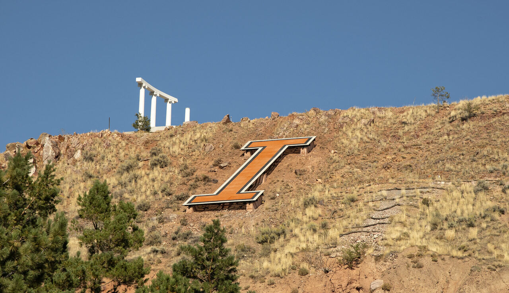

# Hash Collider

This is the source code for the hashcollider challenge
used at Saintcon 2022 Hackers Challenge. The premise of
this challenge is that generating two files with the
same MD5 is trivially easy (computationally).

The setup: I give you an image and you give me two images
back. One of your images must look like mine and the other
must look different, but your two images must have the same
MD5 hash.

## Challenge Configuration

The application is a python flask application which is used to
handle POSTs with file uploads. The file uploads were limited by
the nginx webserver (used as the primary HTTP server and for serving
the static content like the form and the base image).  The flask
application here was configured to run under `gunicorn` which allowed
for multiprocessing.

## Examples

The image below is the base image used in the challenge (I teach at
ISU... go Bengals!):

The two images below are my test submissions for the challenge. They
each have the same MD5 checksum, one looks like my image and the
other doesn't.

and

## Algorithm

The images are first checked for matching hash. There's no point in
continuing if the hashes don't match and this is computationally easy.
Next, both images are converted to grayscale and compared against my
target image using the structural similarity index measure (luckily
this is a function in scikit-image).

The images are checked for similiarity and dissimiliarity using the
SSIM metric and accepted if certain thresholds are met.
